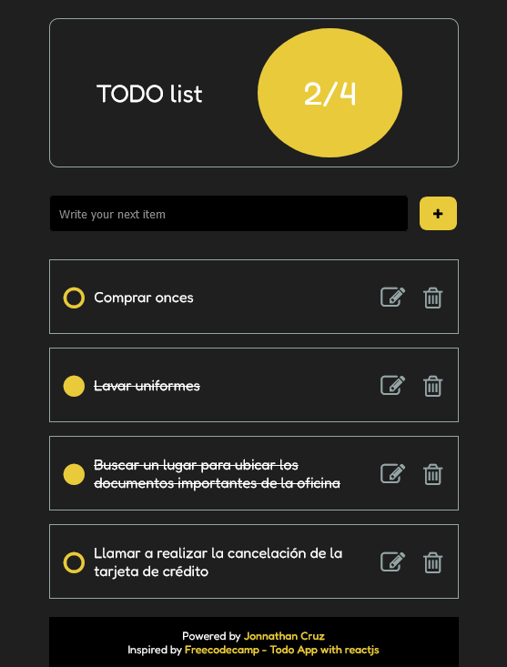
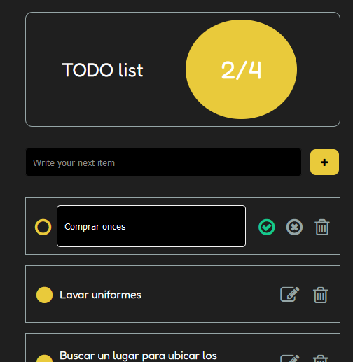

# TODO list. React app

## Descripción

Estudio personal en HTML y hojas de estilo CSS. Busco convertir la investigación en landing pages y web applications de sitios ficticios inpirados en el moodboard 'Dev' en mi [ Pinterest](https://pin.it/5y19mMg), el cual alimento y refresco contínuamente. En esta ocasión la exploración corresponde a la creación de una aplicación tipo lista de pendientes (TODO list) hecha con React JS y Sass.

Aquí puedes explorar la [Demo funcional](https://todo-react.onrender.com).
 
Y aquí puedes ver [todo mi portafolio!!!](https://jonnathan.site) -> Ready to Roll Out! 

## Instalación

Ejecutar los siguientes comandos en la raíz del proyecto: 
<pre>
npm install
npm start
</pre>
Navegar a la URL: <pre>http://localhost:3000/</pre>

## Screenshots

## Pruebas

Funcionalidades de la aplicación:
- Cargar por defecto los items que se encuentran en src/data/data.jsx
- Agregar nuevos items
- Eliminar items
- Editar con opción de aceptar o cancelar la edición
- La estadística se presenta en el círculo amarillo como items marcados / total de items

## Licencia

Este código se distribuye bajo licencia GPLv3.

## Créditos

### Tutoriales:

- https://learn.microsoft.com/en-us/training/paths/react/
- https://www.geeksforgeeks.org/reactjs-jsx-introduction/?ref=lbp
- https://react.dev/learn/

### Inspiración principal:

